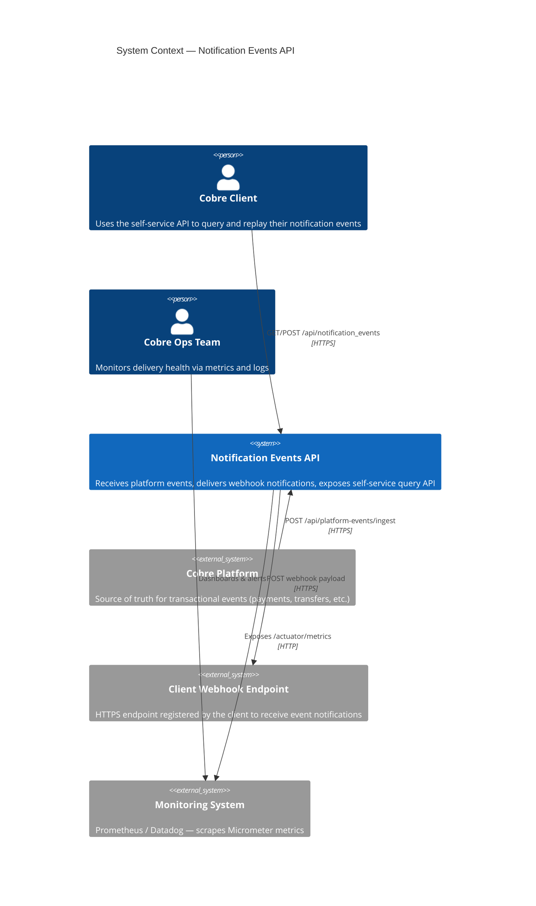
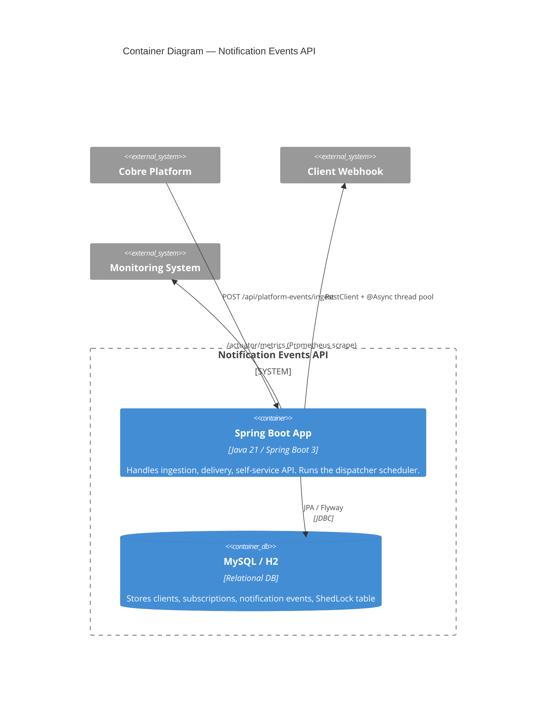
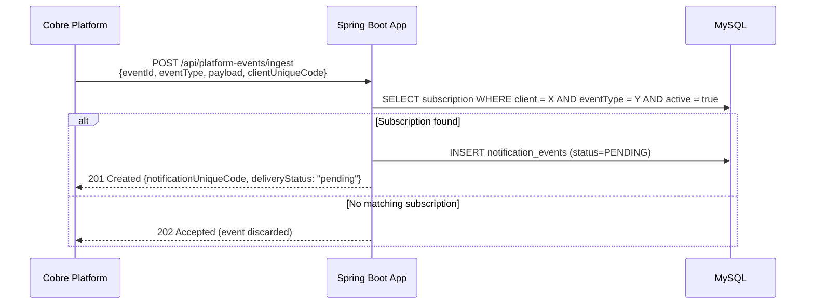
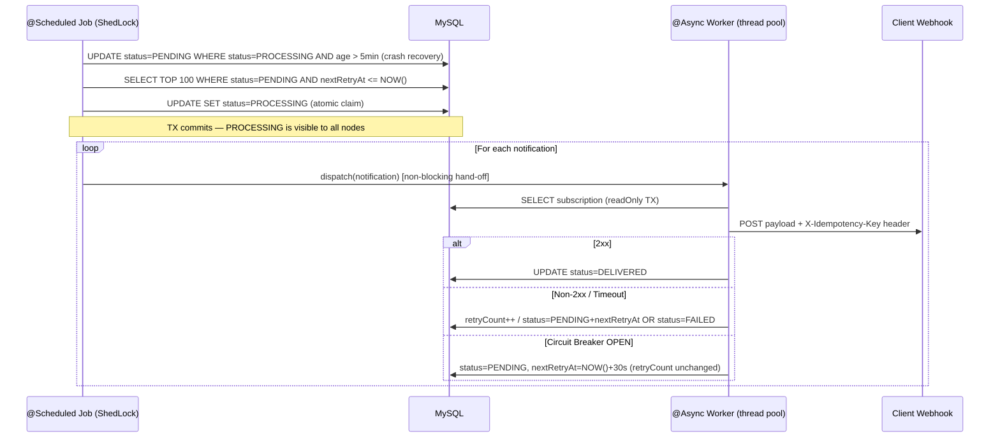
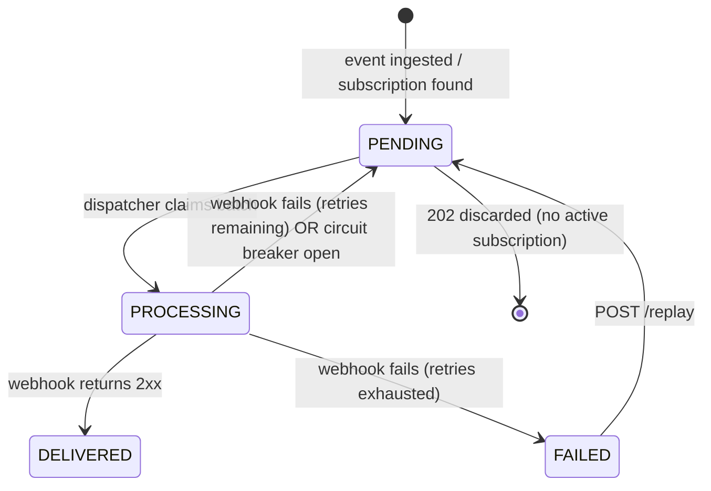

# System Design — Notification Events API

## 1. Context

Cobre's transactional platform generates events (payments, transfers, withdrawals) that must be delivered to clients via webhook. This document covers:

- **Task 1**: Reliable webhook delivery with retry and observability
- **Task 2**: Self-service REST API for clients to query and replay their notifications

---

## 2. C4 — Level 1: System Context



---

## 3. C4 — Level 2: Container Diagram



---

## 4. Hexagonal Architecture

The domain layer has zero framework dependencies. Spring exists only in the infrastructure layer.

```
┌────────────────────────────────────────────────────────────────┐
│                        INFRASTRUCTURE                          │
│                                                                │
│  ┌──────────────┐  ┌───────────────┐  ┌────────────────────┐  │
│  │  REST Layer  │  │  Persistence  │  │  Webhook Adapter   │  │
│  │ (Controllers)│  │  (JPA/Flyway) │  │  (RestClient)      │  │
│  └──────┬───────┘  └───────┬───────┘  └────────┬───────────┘  │
│         │  implements      │  implements        │  implements  │
│  ┌──────▼───────────────────▼────────────────────▼───────────┐ │
│  │                   DOMAIN (pure Java)                       │ │
│  │                                                            │ │
│  │  port/in/  ← Use case interfaces (driving ports)          │ │
│  │  port/out/ ← Repository + Webhook interfaces (driven)     │ │
│  │  usecase/  ← Business logic implementations               │ │
│  │  model/    ← Entities, value objects, enums               │ │
│  └────────────────────────────────────────────────────────────┘ │
└────────────────────────────────────────────────────────────────┘
```

The domain can be tested without a Spring context. Adapters (DB, HTTP client) can be swapped without touching business rules. Dependencies always point inward.

---

## 5. Notification Delivery Flow

### 5.1 Ingestion



### 5.2 Dispatcher (Transactional Outbox)



### 5.3 Retry Strategy

```
Attempt 1 → delay ≈  5s  (±1s jitter)
Attempt 2 → delay ≈ 10s  (±2s jitter)
Attempt 3 → delay ≈ 20s  (±4s jitter)
Attempt N → min(base × 2ⁿ, 60s) + random(0, delay × 0.2)
→ After maxAttempts: status = FAILED
```

Circuit breaker (per client): opens after 50% failure rate over 5 calls → waits 30s → half-open probe. Isolated per `clientUniqueCode` so one client's failures don't affect others.

---

## 6. Notification Event States



---

## 7. Data Model

```
clients
├── id (PK, internal only)
├── unique_code (UQ)          ← external identifier, UUID
├── name, email
├── deleted, created_date, last_modified_date

subscriptions
├── id (PK, internal only)
├── unique_code (UQ)
├── client_id (FK → clients)
├── webhook_url
├── auth_header_name / auth_header_value
├── active, deleted
└── created_date, last_modified_date

subscription_event_types
├── subscription_id (FK)
└── event_type

notification_events
├── id (PK, internal only)
├── unique_code (UQ)
├── event_id                  ← platform event ID, idempotency key at ingestion
├── event_type, payload (TEXT)
├── client_id (FK), subscription_id (FK)
├── delivery_status           ← PENDING | PROCESSING | DELIVERED | FAILED
├── delivered_at, retry_count, next_retry_at, last_error
├── version                   ← optimistic lock (@Version)
└── deleted, created_date, last_modified_date

shedlock
├── name (PK), lock_until, locked_at, locked_by
```

**Key indexes:**
- `(delivery_status, next_retry_at)` — dispatcher batch query
- `(client_id, delivery_status, created_date)` — self-service list query
- `(event_id, client_id)` — unique constraint for idempotent ingestion

Internal `id` columns are never exposed in API responses. All external surfaces use `unique_code` (UUID) to prevent enumeration attacks and decouple consumers from the DB schema.

---

## 8. Scalability Design

### Horizontal scaling

The service is **stateless** — all state lives in the DB. Multiple instances can run concurrently:

| Concern | Solution |
|---|---|
| Duplicate dispatcher runs | **ShedLock** — only one node runs the job per interval |
| Stale PROCESSING records | Crash recovery resets `PROCESSING → PENDING` for events older than 5 min |
| DB connection contention | Status updates use direct `@Modifying UPDATE` queries — no SELECT+merge cycle |

### Delivery concurrency model

Each notification is handed off to an `@Async` thread pool (10–50 threads). Each thread makes a synchronous HTTP call via `RestClient`. At 50 max threads, up to 50 webhook calls can be in-flight simultaneously per instance. For higher throughput, scale horizontally (more instances) or increase the pool size — ShedLock ensures no duplicate dispatching.

### Scaling beyond single-node MySQL

1. **Read replicas** — route `@Transactional(readOnly=true)` queries to replicas
2. **Partitioning** `notification_events` by `client_id` or `created_date`
3. **Message broker** (Kafka/SQS) — replace the polling outbox with an event-driven consumer for lower latency at scale

---

## 9. Resilience Design

| Failure scenario | Recovery |
|---|---|
| Webhook endpoint down | Retry with exponential backoff + jitter; FAILED after N attempts |
| Client endpoint overloaded | Circuit breaker opens per client; other clients unaffected |
| App instance crashes mid-delivery | `PROCESSING` rows reset to `PENDING` on next dispatcher startup |
| Duplicate delivery after crash | `X-Idempotency-Key` header lets receiver deduplicate |
| Concurrent replay of same notification | `@Version` optimistic lock — second request gets 409 Conflict |
| DB temporarily unavailable | Notification stays `PENDING`/`PROCESSING`; no data loss — retried on next run |
| Thundering herd on retry | Jitter in backoff formula distributes retries over time |

**Delivery guarantee:** at-least-once. Exactly-once is impractical with HTTP webhooks (requires 2PC). The `X-Idempotency-Key` on every POST allows receivers to handle duplicates safely — same pattern used by Stripe and Twilio.

---

## 10. Observability

| Signal | Mechanism | Details |
|---|---|---|
| Metrics | Micrometer → Prometheus | `notifications.delivered.count`, `notifications.failed.count`, `notifications.retried.count`, `notifications.webhook.duration` (histogram) — all tagged with `event_type` and `client_unique_code` |
| Health | Spring Actuator `/actuator/health` | DB connectivity, disk space |
| Structured logs | MDC | Every delivery log line carries `notificationId`, `clientId`, `eventType` |
| API docs | springdoc-openapi | Swagger UI at `/swagger-ui.html` |

> **Tag cardinality note:** tagging by `client_unique_code` creates one time-series per client in Prometheus. At scale, consider dropping this tag above a client count threshold or using a high-cardinality-native backend (Grafana Mimir, VictoriaMetrics).

---

## 11. Graceful Shutdown

| Component | Behavior on SIGTERM |
|---|---|
| Active HTTP requests | Tomcat drains in-flight requests up to 30s before closing |
| `@Async` webhook workers | Running threads complete; JVM exit before completion leaves notifications in `PROCESSING` |
| `@Scheduled` dispatcher | ShedLock lock expires naturally (up to 5 min) |

On next startup, the crash recovery step resets any `PROCESSING` notifications older than 5 minutes back to `PENDING`. Re-delivery is safe because of the idempotency key.

---

## 12. Deployment

```
docker compose up
    ├── mysql:8.0       ← persistent volume, Flyway runs migrations on startup
    └── notification-events-api:latest
            ├── Spring Boot on :8080  (API)
            ├── Actuator   on :8081  (metrics, health)
            └── Swagger UI at /swagger-ui.html
```

The service connects to MySQL via environment variables (`DB_URL`, `DB_USERNAME`, `DB_PASSWORD`). Tests use H2 in-memory — no external infrastructure required to run the test suite.
