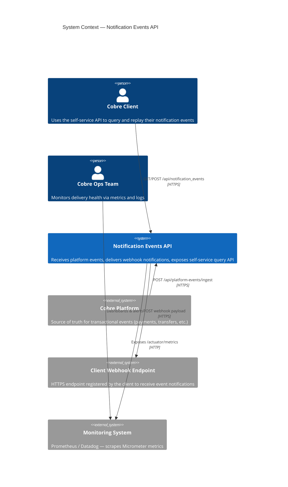
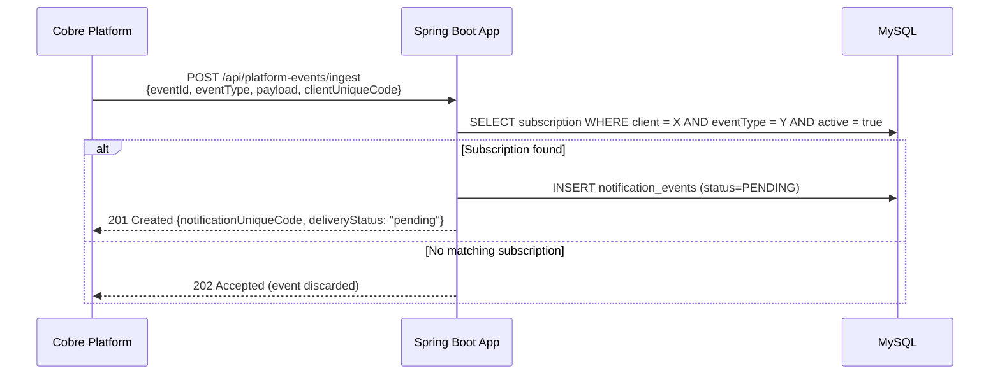
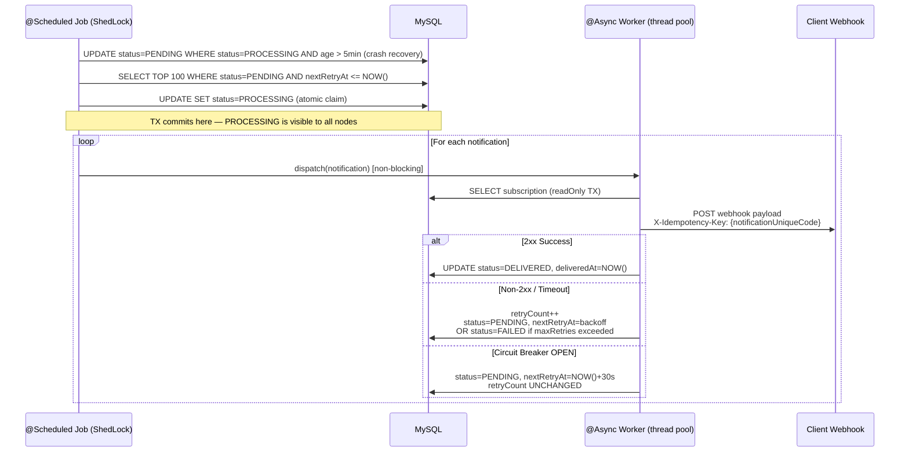
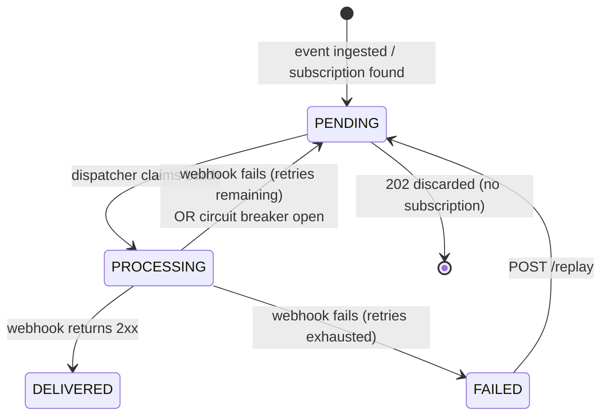

# System Design — Notification Events API

## 1. Context

Cobre's transactional platform generates events (payments, transfers, withdrawals) that must be delivered to clients via webhook. This document covers the design for:

- **Task 1**: Reliable webhook delivery with retry and observability
- **Task 2**: Self-service REST API for clients to query and replay their notifications

---

## 2. C4 — Level 1: System Context



---

## 3. C4 — Level 2: Container Diagram


---

## 4. Hexagonal Architecture

The domain layer has zero framework dependencies. Spring exists only in the infrastructure layer.

```
┌────────────────────────────────────────────────────────────────┐
│                        INFRASTRUCTURE                          │
│                                                                │
│  ┌──────────────┐  ┌───────────────┐  ┌────────────────────┐  │
│  │  REST Layer  │  │  Persistence  │  │  Webhook Adapter   │  │
│  │ (Controllers)│  │  (JPA/Flyway) │  │  (WebClient)       │  │
│  └──────┬───────┘  └───────┬───────┘  └────────┬───────────┘  │
│         │  implements      │  implements        │  implements  │
│  ┌──────▼───────────────────▼────────────────────▼───────────┐ │
│  │                   DOMAIN (pure Java)                       │ │
│  │                                                            │ │
│  │  port/in/  ← Use case interfaces (driving ports)          │ │
│  │  port/out/ ← Repository + Webhook interfaces (driven)     │ │
│  │  usecase/  ← Business logic implementations               │ │
│  │  model/    ← Entities, value objects, enums               │ │
│  └────────────────────────────────────────────────────────────┘ │
└────────────────────────────────────────────────────────────────┘
```

**Why hexagonal?** The domain can be tested without Spring context. Adapters (DB, HTTP client) can be swapped without touching business rules. The dependency rule always points inward.

---

## 5. Notification Delivery Flow

### 5.1 Ingestion



### 5.2 Dispatcher (Transactional Outbox)



### 5.3 Retry Strategy

```
Attempt 1 → delay ≈ 5s  (±1s jitter)
Attempt 2 → delay ≈ 10s (±2s jitter)
Attempt 3 → delay ≈ 20s (±4s jitter)
Attempt N → min(base × 2ⁿ, 60s) + random(0, delay × 0.2)
→ After maxAttempts: status = FAILED
```

Circuit breaker (per client): opens after 50% failure rate over 5 calls → waits 30s → half-open probe.

---

## 6. Notification Event States



---

## 7. Data Model

```
clients
├── id (PK)
├── unique_code (UQ)          ← used as external identifier
├── name
├── email
├── deleted
└── created_date / last_modified_date

subscriptions
├── id (PK)
├── unique_code (UQ)
├── client_id (FK → clients)
├── webhook_url
├── auth_header_name / auth_header_value
├── active
├── deleted
└── created_date / last_modified_date

subscription_event_types
├── subscription_id (FK)
└── event_type                ← VARCHAR, stored as enum name

notification_events
├── id (PK)
├── unique_code (UQ)
├── event_id                  ← external platform event ID
├── event_type
├── payload (TEXT)
├── client_id (FK → clients)
├── subscription_id (FK → subscriptions)
├── delivery_status           ← PENDING | PROCESSING | DELIVERED | FAILED
├── delivered_at
├── retry_count
├── next_retry_at
├── last_error (TEXT)
├── version                   ← optimistic lock (@Version)
├── deleted
└── created_date / last_modified_date

shedlock
├── name (PK)
├── lock_until
├── locked_at
└── locked_by
```

**Key indexes:**
- `idx_ne_dispatch`: `(delivery_status, next_retry_at)` — dispatcher batch query
- `idx_ne_query`: `(client_id, delivery_status, created_date)` — self-service list query
- `uq_notification_events_event_client`: `(event_id, client_id)` — idempotency at ingestion

### Internal vs. external identifiers

Database `id` (BIGINT autoincrement) columns are **never exposed** in any API response or accepted
as input. Every API surface uses `unique_code` (UUID) exclusively:

- URL paths: `/api/clients/{clientUniqueCode}/subscriptions/{subscriptionUniqueCode}`
- Query params: `clientUniqueCode=...`
- Response bodies: `"uniqueCode": "uuid"`

Internal `id` fields are used only inside the persistence layer for foreign key joins and index
performance. This prevents enumeration attacks (no sequential IDs to probe), decouples external
consumers from DB schema changes, and eliminates a whole class of BOLA vulnerabilities where
an attacker increments an ID by 1 to access another user's resource.

---

## 8. Scalability Design

### Horizontal scaling
The service is **stateless** — all state lives in MySQL. Multiple instances can run concurrently:

| Concern | Solution |
|---|---|
| Duplicate dispatcher runs | **ShedLock** — DB-level distributed lock; only one node runs the job per interval |
| Stale PROCESSING records | Crash recovery step resets `PROCESSING → PENDING` for events older than 5 minutes |
| DB connection pool exhaustion | WebClient is **non-blocking** — webhook HTTP calls never hold a DB connection |

### Load characteristics
- **Write path (ingest)**: one DB write per event; simple FK lookup for subscription check; P99 < 50ms
- **Read path (self-service)**: paginated queries with composite index; no full-table scans
- **Delivery path**: `@Async` thread pool (default 10–50 threads); `@SchedulerLock` prevents fan-out from multiple nodes; WebClient handles thousands of concurrent HTTP requests with ~10 threads via Reactor Netty's event loop

### Scaling beyond single-node MySQL
When write throughput requires it:
1. **Read replicas** for self-service GET queries (route via `@Transactional(readOnly=true)`)
2. **Partitioning** `notification_events` by `client_id` or `created_date`
3. **Message broker** (Kafka/SQS) as an alternative to polling-based outbox — platform publishes events to a topic; service consumes and inserts

---

## 9. Resilience Design

| Failure scenario | Detection | Recovery |
|---|---|---|
| Webhook endpoint down | Non-2xx or timeout | Retry with exponential backoff + jitter; FAILED after N attempts |
| Client's endpoint overloaded | High failure rate | Circuit breaker opens per client; isolates one client's failures from others |
| App instance crashes mid-delivery | `PROCESSING` row with old `last_modified_date` | Crash recovery in next dispatcher run resets to `PENDING` |
| Duplicate delivery after crash | App delivers, crashes before DB update | `X-Idempotency-Key` header lets receiver deduplicate |
| Duplicate concurrent replay requests | Two threads read `status=FAILED` simultaneously | `@Version` optimistic lock; second thread gets 409 Conflict |
| DB temporarily unavailable | JPA throws exception | Notification stays `PENDING` / `PROCESSING`; no data loss — retry on next run |
| Thundering herd on retry | Many notifications ready at same time | Jitter in backoff formula distributes retries over time |

### At-least-once delivery guarantee
The Transactional Outbox pattern guarantees **at-least-once** delivery. This is a deliberate tradeoff:

- **At-most-once** (fire and forget) would lose events on crash
- **Exactly-once** would require distributed transactions (2PC) — impractical with HTTP webhooks
- **At-least-once** + idempotency key at the receiver is the standard industry pattern (used by Stripe, Twilio, etc.)

---

## 10. Observability

| Signal | Mechanism | Details |
|---|---|---|
| Metrics | Micrometer → Prometheus | `notifications.delivered.count{event_type, client_unique_code}`, `notifications.failed.count`, `notifications.retried.count`, `notifications.webhook.duration` (histogram) |
| Health | Spring Actuator | `/actuator/health` includes circuit breaker state per client |
| Structured logs | MDC | Every log line in the delivery path carries `correlation_id`, `client_unique_code`, `event_id`, `event_type` |
| API docs | springdoc-openapi | Swagger UI at `/swagger-ui.html` |

**Tag cardinality note:** tagging metrics with `client_unique_code` is a deliberate decision. In
Prometheus, high-cardinality label values (one per client) increase the time-series count linearly
with the client base. At scale (thousands of clients), this creates memory pressure on the
Prometheus server. The mitigations for production:
- Set a client count threshold above which `client_unique_code` is dropped from the tag set and
  only `event_type` is kept
- Use a recording rule to pre-aggregate per-client metrics into daily summaries
- Or use a metrics backend that handles high cardinality natively (Grafana Mimir, VictoriaMetrics)

---

## 11. Graceful Shutdown

When the application receives a SIGTERM (e.g., `docker compose stop`, Kubernetes rolling deploy),
Spring Boot's embedded Tomcat stops accepting new requests. The in-flight state is:

| Component | Behavior on shutdown |
|---|---|
| Active HTTP requests | Tomcat waits up to `server.shutdown.graceful-timeout` (default 30s) for in-flight requests to complete before forcefully closing |
| `@Async` webhook workers | Worker threads are running independently. If the JVM exits before they complete, those notifications remain in `PROCESSING` state in the DB |
| `@Scheduled` dispatcher | ShedLock releases the lock when the lock's `lock_until` timestamp expires (max 5 minutes with `PT5M` config) |

**Recovery on next startup:** the dispatcher's crash recovery step (first action in every run)
resets `PROCESSING → PENDING` for notifications whose `last_modified_date < NOW() - 5min`. Any
notifications that were mid-delivery when the JVM stopped will be retried on the next instance.

This means there is a potential **at-least-once re-delivery window** of up to 5 minutes after a
crash, which is acceptable by design. The `X-Idempotency-Key` header on every webhook POST allows
receivers to deduplicate without data loss.

**Config for production:**
```yaml
server:
  shutdown: graceful
  tomcat:
    threads:
      max: 200
spring:
  lifecycle:
    timeout-per-shutdown-phase: 30s    # wait for in-flight HTTP requests
```

---

## 12. Deployment

```
docker compose up
    ├── mysql:8.0       ← persistent volume, Flyway runs V1 + V2 on startup
    └── notification-events-api:latest
            ├── Spring Boot on port 8080
            ├── Actuator on /actuator/*
            └── Swagger UI at /swagger-ui.html
```

The service connects to MySQL via `SPRING_DATASOURCE_URL` environment variable. H2 in-memory DB is used for test execution (`src/test/resources/application.yml`).
